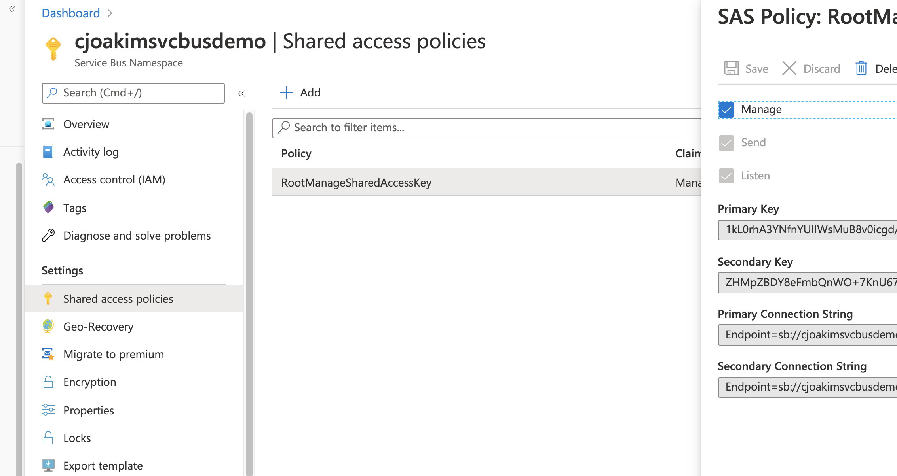
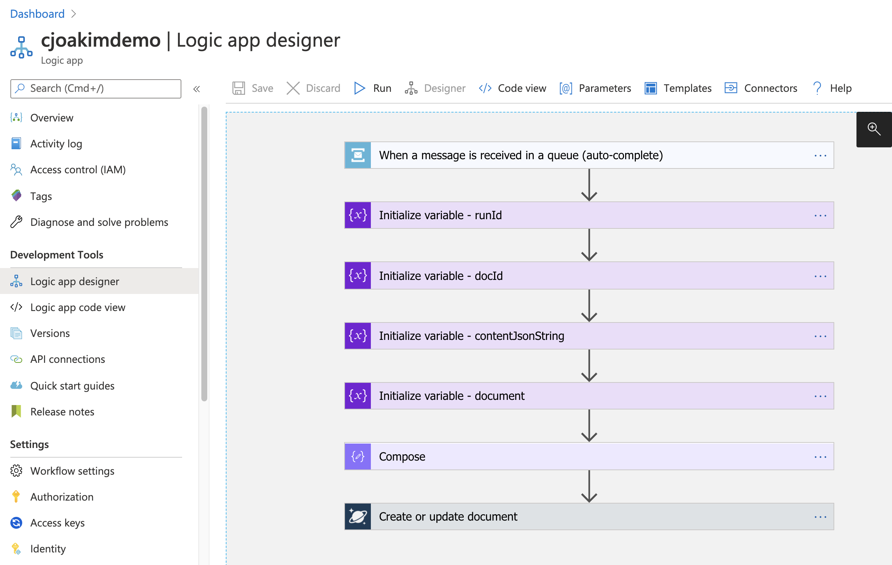

# azure-java-servicebus-logicapp

Java console app putting messages on an Azure Service Bus queue, triggering an Azure Logic App

## Links

- https://docs.microsoft.com/en-us/azure/service-bus-messaging/service-bus-java-how-to-use-queues
- https://docs.microsoft.com/en-us/azure/developer/java/sdk/java-sdk-azure-get-started
- https://search.maven.org/artifact/com.microsoft.azure/azure-servicebus/3.3.0/jar

---

## Azure Provisioning

### Azure Service Bus

Create an Azure Service Bus account, with a queue named **events**.

Shell and AZ CLI script **automation/az_cli/servicebus.sh** can be used to provision
your Service Bus account; just alter the values in **automation/env.sh** first.

Then capture the **Connection String** in Azure Portal as shown below:



Then set the following two environment variables in your system; the Java app will use these.
- AZURE_DEMO_SERVICEBUS_CONN_STRING
- AZURE_DEMO_SERVICEBUS_QUEUE

### Azure CosmosDB

Create an Azure CosmosDB account with the SQL API.
Within the account create a database named **dev** with an **events** collection
which has the partition-key attribute **/pk**.

Shell and AZ CLI script **automation/az_cli/cosmos_sql.sh** can be used to provision
your CosmosDB account; just alter the values in **automation/env.sh** first.

---

## Java Project

- Generated with **mvn-generate.sh**
- Compiled with **build.sh**
- Executed with **run.sh**

### Versions

```
$ java -version
openjdk version "1.8.0_232"
OpenJDK Runtime Environment (Zulu 8.42.0.23-CA-macosx) (build 1.8.0_232-b18)
OpenJDK 64-Bit Server VM (Zulu 8.42.0.23-CA-macosx) (build 25.232-b18, mixed mode)

$ mvn -version
Apache Maven 3.6.3
```

### pom.xml entry for the Azure Service Bus SDK

```
    <dependency>
      <groupId>com.microsoft.azure</groupId>
      <artifactId>azure-servicebus</artifactId>
      <version>3.3.0</version>
    </dependency>
```

### Airport Data Messages

This app uses file **us_airports_flat.json** in this repo. 
Each line consists of a JSON document, like the following.
These are put on the Azure Service Queue as messages.

```
{
  "name": "Charlotte Douglas Intl",
  "city": "Charlotte",
  "country": "United States",
  "iata_code": "CLT",
  "latitude": "35.214",
  "longitude": "-80.943139",
  "altitude": "748",
  "timezone_num": "-5",
  "timezone_code": "America/New_York",
  "location": {
    "type": "Point",
    "coordinates": [
      -80.943139,
      35.214
    ]
  },
  "id": "4b98b172-2e9e-11ea-a7b6-7fc29890ecb3",
  "pk": "CLT"
}
```

### Compiling

This demo Java application consists of only one *.java file; App.java.

```
$ ./build.sh

...

[INFO] Building jar: /Users/cjoakim/github/azure-java-servicebus-logicapp/servicebusdemo/target/servicebusdemo-1.0-SNAPSHOT.jar
[INFO] ------------------------------------------------------------------------
[INFO] BUILD SUCCESS
[INFO] ------------------------------------------------------------------------
[INFO] Total time:  2.420 s
[INFO] Finished at: 2020-05-29T13:33:35-04:00
[INFO] ------------------------------------------------------------------------
done
```

### Executing the Java program to send Service Bus Messages

```
./run.sh

...
airport data read; line count: 1697
connString: ...
queueName:  events
SLF4J: Failed to load class "org.slf4j.impl.StaticLoggerBinder".
SLF4J: Defaulting to no-operation (NOP) logger implementation
SLF4J: See http://www.slf4j.org/codes.html#StaticLoggerBinder for further details.
client Id:  b44f82

sending message: {"name":"Charlotte Douglas Intl","city":"Charlotte","country":"United States","iata_code":"CLT","latitude":"35.214","longitude":"-80.943139","altitude":"748","timezone_num":"-5","timezone_code":"America/New_York","location":{"type":"Point","coordinates":[-80.943139,35.214]},"id":"4b98b172-2e9e-11ea-a7b6-7fc29890ecb3","pk":"CLT"}

closing client...
client closed
done
```

---

## Azure Logic App

Manually provision an Azure Logic App, then use the UI designer to create the following:



You can reference the code in file **logicapp/code.json**, or even paste it into
your Logic App Code View.  You'll have to change the values of /subscriptions/<your-subscription-id>/
to your actual Azure subscription Id.

You'll need to configure two specific connections in your Logic App:
1) To your Service Bus instance
2) to your CosmosDB instance

Then, execute the above Java program with **./run.sh** to cause messages to be put
on the Service Bus queue, which will trigger the Logic App.

---

## Azure CosmosDB

### Sample Document inserted by the Logic App

```
{
    "doc": {
        "name": "Charlotte Douglas Intl",
        "city": "Charlotte",
        "country": "United States",
        "iata_code": "CLT",
        "latitude": "35.214",
        "longitude": "-80.943139",
        "altitude": "748",
        "timezone_num": "-5",
        "timezone_code": "America/New_York",
        "location": {
            "type": "Point",
            "coordinates": [
                -80.943139,
                35.214
            ]
        },
        "id": "4b98b172-2e9e-11ea-a7b6-7fc29890ecb3",
        "pk": "CLT"
    },
    "id": "2020-05-29t21:07:09.4898866z-08586108204717469253271117817cu33",
    "pk": "runid-08586108204717469253271117817cu33",
    "triggerInfo": {
        "ContentData": "eyJuYW1lIjoiQ2hhcmxvdHRlIERvdWdsYXMgSW50bCIsImNpdHkiOiJDaGFybG90dGUiLCJjb3VudHJ5IjoiVW5pdGVkIFN0YXRlcyIsImlhdGFfY29kZSI6IkNMVCIsImxhdGl0dWRlIjoiMzUuMjE0IiwibG9uZ2l0dWRlIjoiLTgwLjk0MzEzOSIsImFsdGl0dWRlIjoiNzQ4IiwidGltZXpvbmVfbnVtIjoiLTUiLCJ0aW1lem9uZV9jb2RlIjoiQW1lcmljYS9OZXdfWW9yayIsImxvY2F0aW9uIjp7InR5cGUiOiJQb2ludCIsImNvb3JkaW5hdGVzIjpbLTgwLjk0MzEzOSwzNS4yMTRdfSwiaWQiOiI0Yjk4YjE3Mi0yZTllLTExZWEtYTdiNi03ZmMyOTg5MGVjYjMiLCJwayI6IkNMVCJ9",
        "ContentType": "",
        "ContentTransferEncoding": "Base64",
        "Properties": {
            "DeliveryCount": "1",
            "EnqueuedSequenceNumber": "0",
            "EnqueuedTimeUtc": "2020-05-29T21:07:08Z",
            "ExpiresAtUtc": "9999-12-31T23:59:59Z",
            "LockedUntilUtc": "2020-05-29T21:08:08Z",
            "LockToken": "5ab3d76b-179a-45d8-9810-120260aa9d33",
            "MessageId": "a709a5d4-3882-4349-87de-7b8159481749",
            "ScheduledEnqueueTimeUtc": "0001-01-01T00:00:00Z",
            "SequenceNumber": "56",
            "Size": "462",
            "State": "Active",
            "TimeToLive": "9223372036854775807"
        },
        "MessageId": "a709a5d4-3882-4349-87de-7b8159481749",
        "To": null,
        "ReplyTo": null,
        "ReplyToSessionId": null,
        "Label": null,
        "ScheduledEnqueueTimeUtc": "0001-01-01T00:00:00Z",
        "SessionId": null,
        "CorrelationId": null,
        "SequenceNumber": 56,
        "LockToken": "5ab3d76b-179a-45d8-9810-120260aa9d33",
        "TimeToLive": "9223372036854775807"
    },
    "_rid": "LFMmAN6z3pcDAAAAAAAAAA==",
    "_self": "dbs/LFMmAA==/colls/LFMmAN6z3pc=/docs/LFMmAN6z3pcDAAAAAAAAAA==/",
    "_etag": "\"12004085-0000-0100-0000-5ed1797d0000\"",
    "_attachments": "attachments/",
    "_ts": 1590786429
}
```
